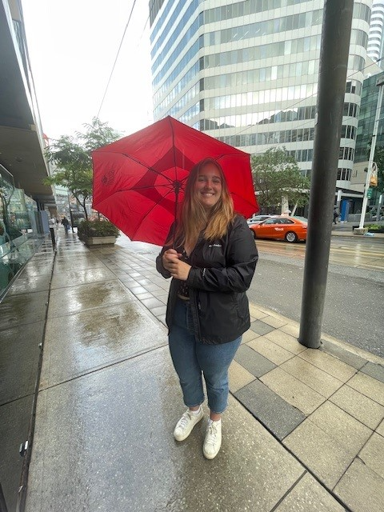

# Hi there 👋
My name is **Laura Earl** 

and I'm in the third year of my undergrad at Dalhousie University. I am Majoring in Neuroscience with a certificate in [Neurotechnology and Innovation](https://www.dal.ca/faculty/science/psychology_neuroscience/programs/certificate-programs/neurotech_innovation.html). 

## Why I'm Here

I started to be intrested in neuroscience and how the brain works in general after my grade 11 Biology teacher taught a short neuroscience unit. I **loved** the idea that there is still so much to discover and how there are so many different disiplines within the field that you can get into. Its the same kind of thinking that made me take this course (NESC3505). I want to know how to code so that I can use those skills on future projets. 

## Future Plans 🎓
After graduation I would like to, (*in no particular order*)... 
- Work on a BCI project
- Travel 🌆
- Complete a MBA
<!--
**LauraEar1/LauraEar1** is a ✨ _special_ ✨ repository because its `README.md` (this file) appears on your GitHub profile.

Here are some ideas to get you started:

- 🔭 I’m currently working on ...
- 🌱 I’m currently learning ...
- 👯 I’m looking to collaborate on ...
- 🤔 I’m looking for help with ...
- 💬 Ask me about ...
- 📫 How to reach me: ...
- 😄 Pronouns: ...
- ⚡ Fun fact: ...
-->
